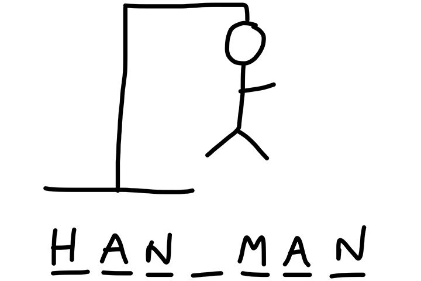

# Hangman 
<details>
<summary><b> What is Hangman:</b></summary>
<br>

Hangman game is about quessing the correct, by inputing letters, if the `input letter` does exist the word, then `letters` same as `input letter` are uncovered for example:
````markdown
    The word: Queen.
    Word present to the user: _ _ _ _ _
    User's input: `e`.
    Word present to the user: _ _ e e _
````
The proceeds without transitioning the next hanging phase of the hangman, if the user prompted non existing letter, the hanging process procceds until the hanging phase is complete before the user full guessed the word.
<br>


</details>


<details>
<summary><b> How is Hangman built:</b></summary>
<br>

- **`Declarations`**:<br>
    - `1` Module:
        - `random`: implementing `.choice`.
    
    - `3` Arrays:
        - `HANGMANPICS`: It contains the ASCII art representation of the `hangman` phases.
        - `word_list`: Contains the words that the user should guess corrctly.
        - `diplaying_user_uncovered_word`: Contains number letters equal to the length of the guessed word.

    - `8` Variables:
        - `char`: Instance of a singular char in a array:.
        - `is_man_dead`: Boolean for checking if the user failed all trials and uncovered the word.
        - `is_there_a_user_uncovered_letter`: Boolean for checking if there is remaining letters uncovered by the user.
        - `stage_of_hanging`: It is the index refering to the phase of the hanging process, and the user's number of failed trials.
        - `selected_word`: The selected word for the current game.
        - `displaying_user_uncovered_word_list`: A string Contains the uncovered letters by the user.
        - `user_letter_input`: The input letter.
        - `index`: Instance to access element's vale by its position in array.


- **`Plan`**: <br>
 Creating a word list, selecting one word from the list, appending an array with `_` with the length of the word, declaring the stage of as an index for phase of hanging picture, iterating it whenever the user's prompt letter is wrong. After prompt, looping over the length of the word, checking if there is a char in the guessed word same as the user's prompted letter, thus then toggling the boolean checker for if any letter is covered. If a match is found, updating the displayed word array at that specific index by temporarily converting the array to a mutable list. If no matching character is found, incrementing the hanging stage counter and printing the corresponding ASCII art stage. Repeating this cycle until either the user reveals all characters to save the man or reaches the maximum number of failed trials resulting in a loss.
- **`Strategy`**:<br>

- **Word Masking**: Construct a parallel display state array of underscores equal to `len(selected_word)` to conceal the secret word while preserving index positioning.

- **Iterative Matching**: For every user input, iterate through `selected_word` with an explicit index counter to evaluate equality against `user_letter_input`.

- **In-place Mutation Workaround**: Cast `displaying_user_uncovered_word` into a temporary list during match detection to bypass Python string immutability, updating revealed positions on index alignment before joining back to string form.

- **Error Handling & Escalation**: Monitor a boolean flag (`is_there_a_user_uncovered_letter`) per guess cycl- If `False`, increment `stage_of_hanging` to access the next visual index in `HANGMANPICS`.

- **Termination Conditions**: Evaluate win state via full equality check (`displaying_user_uncovered_word == selected_word`) or loss state via stage completion (`stage_of_hanging == 6`).

<details>
<summary><b> Input/Output Table:</b></summary>
<br>

|${\color{blue}\text{Input}}$: | ${\color{red}\text{Output}}$:| 
|:---|:---|
|(1) Letter (string) | (1) Hangman hanging phase (ASCII Art)|
||(2) Indicator whether the user won or lost |


<br>
</details>

</details>


<details>
<summary><b>Why build Hangman:</b></summary>
<br>

- Practice applying fundamental Python control flow structures including `while` loops, `for` loops, and conditional statements (`if/else`).
- Learn string and array manipulation, specifically converting between string representations and list data structures to mutate immutable strings.
- Manage dynamic game state tracking using boolean flags and index-based iteration counters.
- Gain hands-on experience in terminal UI design through ASCII art rendering based on state array indices.
- Strengthen skills in user input sanitization and string normalization using `.lower()`.
</details>